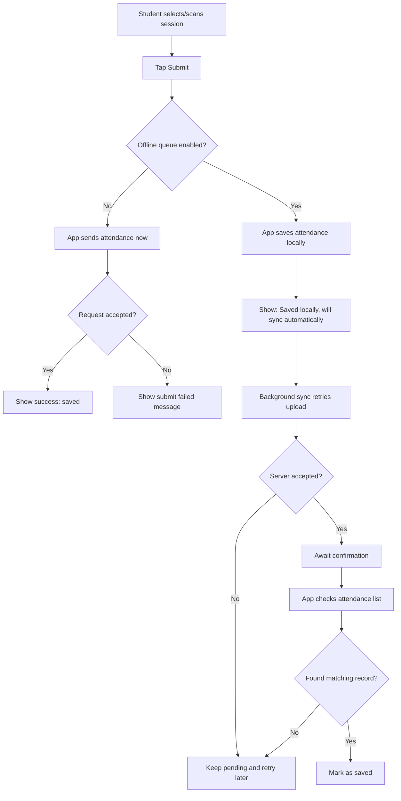
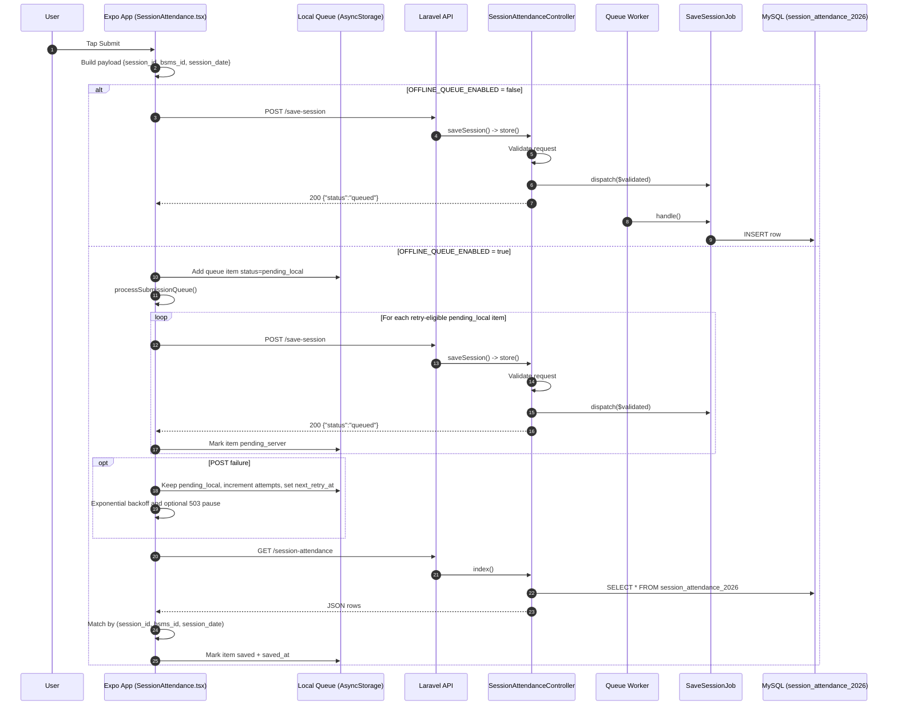

# SaveSession Flow Notes

This document describes the exact current `save-session` flow from the Expo app queue through Laravel API handling, queued MySQL persistence, and app-side confirmation.

## User Perspective Flow



```text
[Student selects/scans session]
              |
              v
         [Tap Submit]
              |
              v
   +-------------------------------+
   | Offline queue enabled?        |
   +-----------+-------------------+
               |
      +--------+--------+
      |                 |
     No                Yes
      |                 |
      v                 v
[App sends now]   [Save locally]
      |                 |
      v                 v
[Accepted?]      [Show: Saved locally,
  |   |           will sync automatically]
  |   |                 |
  |   +--> No           v
  |      [Show fail] [Background sync retries]
  |                     |
  +--> Yes              v
[Show saved]       [Server accepted?]
                    |            |
                    |            +--> No
                    |                 [Keep pending + retry later]
                    |
                    +--> Yes
                         |
                         v
                [Await confirmation]
                         |
                         v
                [Check attendance list]
                         |
                         v
                [Matching record found?]
                    |            |
                    |            +--> No
                    |                 [Keep pending + retry later]
                    |
                    +--> Yes
                         |
                         v
                     [Mark as saved]
```

- Student submits attendance from the app.
- In direct mode, success/failure is immediate.
- In offline queue mode, the app first confirms local save.
- The app retries background upload automatically.
- The item is only fully complete when server confirmation is detected and marked `saved`.

## Overview

When a student submits session attendance in `SessionAttendance.tsx`, the app either posts directly to `POST /save-session` (if offline queue is disabled) or stores a queue item locally and syncs in the background (if enabled). The backend validates and queues the write via `SaveSessionJob`, immediately returns `{"status":"queued"}`, and the app later confirms persistence by polling `GET /session-attendance` and matching rows.

## Mermaid Sequence Diagram



## ASCII Flowchart

```text
[User taps Submit]
        |
        v
[SessionAttendance.tsx onSubmit]
        |
        +--> Validate selectedSessionId + bsmsId
        |
        +--> Build {session_id, bsms_id, session_date}
        |
        v
+--------------------------------------+
| OFFLINE_QUEUE_ENABLED ?              |
+-------------------+------------------+
                    |
        +-----------+-----------+
        |                       |
       NO                      YES
        |                       |
        v                       v
[POST /save-session]     [Queue item in AsyncStorage:
        |                 status=pending_local]
        |                       |
        v                       v
[Laravel route]          [processSubmissionQueue()]
POST save-session               |
 -> SessionAttendanceController@saveSession
 -> store()                     +--> for each pending_local ready to retry:
        |                              POST /save-session
        v                              |
[Validate request]                     +--> success:
  - bsms_id required string                 status -> pending_server
  - session_date required date           |
  - session_id exists MonitoredSessions2026,ID
        |                              +--> failure:
        v                                  status stays pending_local
[SaveSessionJob::dispatch()]               attempts++, next_retry_at set
        |                                  backoff / optional 503 pause
        v
[Return 200 {"status":"queued"}]   [Then GET /session-attendance]
        |                                      |
        v                                      v
[Queue worker picks job]                [Controller@index returns rows]
        |                                      |
        v                                      v
[SaveSessionJob::handle()]             [App matches row by:
        |                               session_id + bsms_id + session_date]
        v                                      |
[SessionAttendance2026::create()]             v
        |                               [Queue item -> saved]
        v
[MySQL insert into session_attendance_2026]
```

## Status Meanings

- `pending_local`: Saved locally in the app queue but not yet accepted by backend `POST /save-session`.
- `pending_server`: Backend accepted request (`{"status":"queued"}`), but app has not yet confirmed DB row via `GET /session-attendance`.
- `saved`: App found a matching DB row from `GET /session-attendance` and marked the queue item complete.

## Failure Points (Short List)

- Client validation failure (no selected session or no resolved `bsms_id`): submit is blocked in app.
- Auth failure (`401`): `POST /save-session` fails if Sanctum bearer token is missing/invalid/expired.
- Network or timeout failure: item stays `pending_local` and retries with backoff.
- Repeated `503` responses: app pauses retries temporarily (`SUBMISSION_503_PAUSE_MS`).
- Backend validation failure (`422`): payload rejected if `session_id` not in `MonitoredSessions2026` or date/fields invalid.
- Queue worker not running (or delayed): API still returns `{"status":"queued"}`, but DB insert is delayed or never executed.
- Confirmation lag: write may exist later; app only marks `saved` after polling `GET /session-attendance` and finding a match.

## Key Endpoints and Files

### Endpoints
- `POST /api/save-session` (auth required)
- `POST /api/session-attendance` (same store logic, auth required)
- `GET /api/session-attendance` (confirmation list)
- `GET /api/monitored-sessions` (session picker data)

### Expo App Files
- `app/SessionAttendance.tsx`
- `helpers/axiosConfig.ts`

### Laravel Files
- `routes/api.php`
- `app/Http/Controllers/SessionAttendanceController.php`
- `app/Jobs/SaveSessionJob.php`
- `app/Models/SessionAttendance2026.php`
- `app/Models/MonitoredSessions2026.php`
